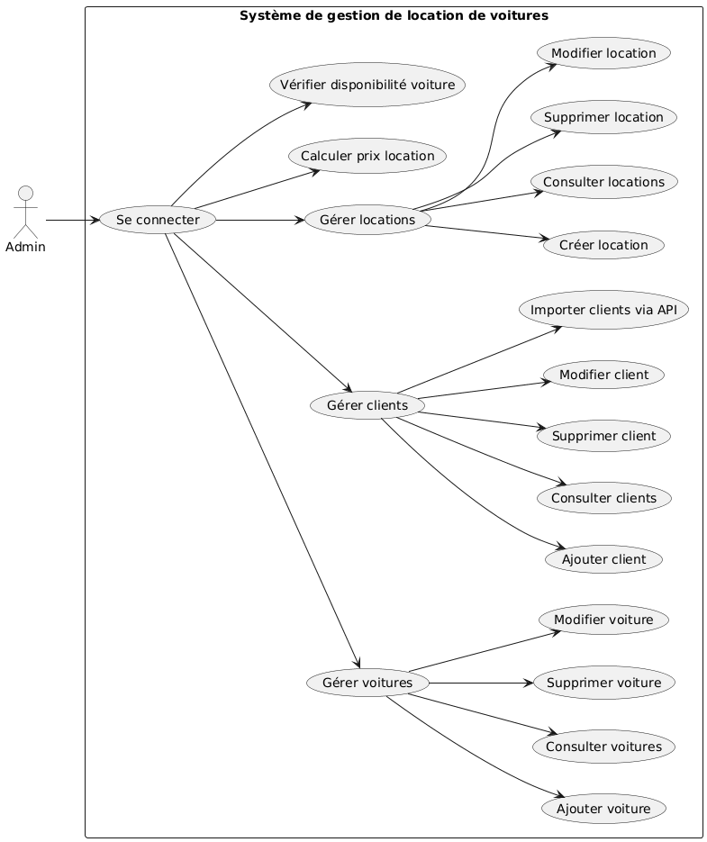
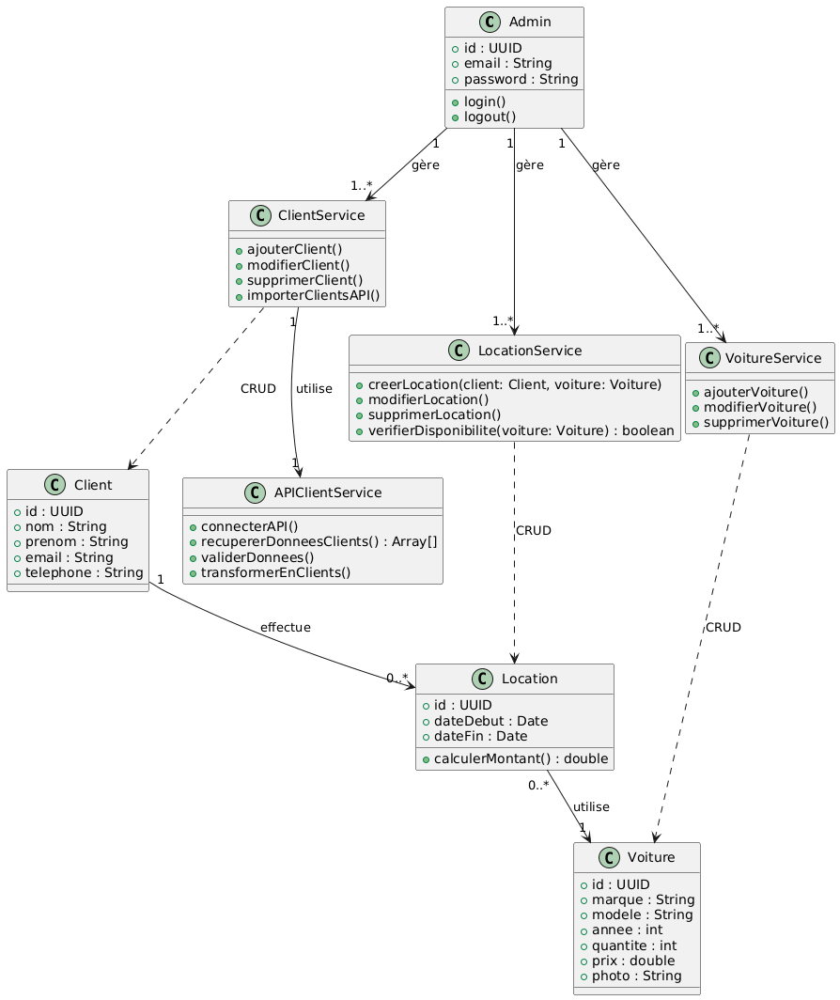

# Gestion Location Voitures

Application mobile de gestion d'une agence de location de voitures, développée avec **React Native (Expo)** et **Supabase**.

## Présentation

Cette application permet à une agence de location de gérer son activité depuis un smartphone : clients, véhicules et locations. Elle a été réalisée dans un cadre académique.

## Fonctionnalités

- Gestion des **clients** (ajout, consultation, modification, suppression)
- Gestion du **parc de véhicules** avec photos
- Gestion des **locations** (choix des dates, véhicule, client)
- Navigation fluide : menu latéral (drawer) et onglets
- Données stockées et synchronisées via **Supabase**

> Adapte cette liste à ce que ton application fait réellement.

## Technologies

| Domaine | Technologies |
|---|---|
| Mobile | React Native 0.81, Expo SDK 54, React 19 |
| Navigation | React Navigation (Drawer, Bottom Tabs, Native Stack) |
| Backend / Base de données | Supabase (PostgreSQL) |
| UI | Expo Linear Gradient, Expo Blur, Expo Vector Icons, Reanimated |
| Médias et formulaires | Expo Image Picker, DateTimePicker, Picker |

## Conception

Les diagrammes UML du projet sont disponibles dans le dépôt :

- Diagramme de cas d'utilisation : [`useCaseTrue.png`](./useCaseTrue.png)
- Diagramme de classes : [`ClasseTrue.png`](./ClasseTrue.png)

<p align="center">
  
  
</p>

## Structure du projet

```
.
├── assets/          # Images et ressources
├── src/             # Code source (écrans, composants, services)
├── App.js           # Composant racine
├── index.js         # Point d'entrée
├── app.json         # Configuration Expo
└── package.json
```

## Installation et lancement

### Prérequis

- [Node.js](https://nodejs.org/) (version LTS)
- Un projet [Supabase](https://supabase.com/)
- L'application **Expo Go** sur ton téléphone, ou un émulateur Android / iOS

### Étapes

```bash
# 1. Cloner le dépôt
git clone https://github.com/LI-ISSAM/Gestion-Location-Voitures.git
cd Gestion-Location-Voitures

# 2. Installer les dépendances
npm install

# 3. Lancer l'application
npm start
```

Scanne ensuite le QR code avec Expo Go, ou utilise :

```bash
npm run android   # émulateur Android
npm run ios       # simulateur iOS (macOS)
npm run web       # navigateur
```

## Configuration de Supabase

1. Crée un projet sur [supabase.com](https://supabase.com/).
2. Crée les tables nécessaires (clients, véhicules, locations).
3. Renseigne l'URL du projet et la clé `anon` dans le fichier où le client Supabase est initialisé (`createClient(...)`).

> Ne publie jamais de clé secrète (`service_role`) dans le dépôt. Seule la clé `anon` est destinée à une application cliente, et elle doit être protégée par des règles **Row Level Security**.

## Améliorations possibles

- Authentification des utilisateurs
- Notifications de fin de location
- Tableau de bord avec statistiques
- Paiement en ligne

